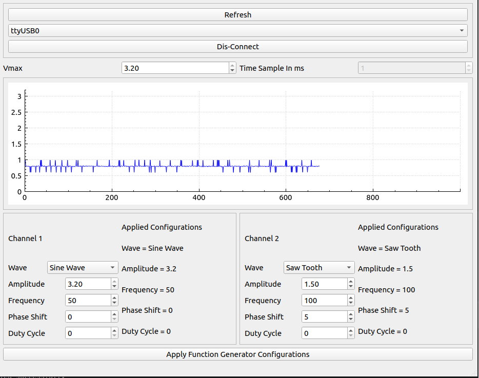
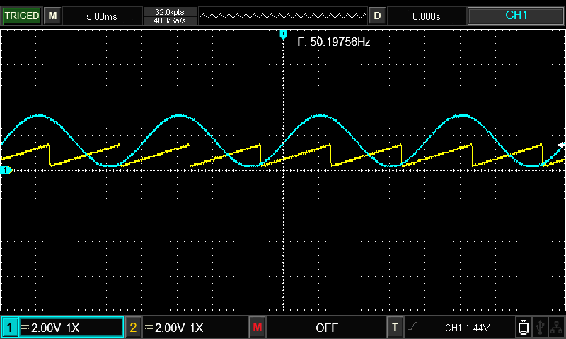
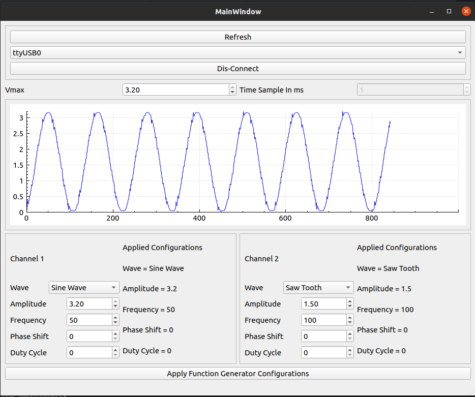

# Oscilloscope with Function Generator GUI

The project features a user-friendly GUI designed with Qt C++ to visual sampled signal and the control of function generator channels.

A signal sampling mechanism is achieved through the configuration of the STM32 Advanced Timer to trigger the Analog to Digital Converter (ADC).

Implementation includes the use of Direct Memory Access (DMA) in double buffer mode, optimizing the reading of ADC sampled values and their smooth transfer over UART.

Users can manipulate and control two channels of the function generator through the GUI. The STM32 Basic Timer is configured to trigger the DAC converter, enabling the generation of predefined signal arrays. Signal parameters are customizable through the GUI, offering flexibility in waveform selection and control.

Function generator can output sine-wave, triangle-wave, saw tooth-wave, and square wave signals. Maximum frequecy for each signal is 5 KHz. In this version Duty cycle configuration is available only in square-wave.

Please Note that this version is demo and may contain minor  bugs.

## Screen Shots ofFunction Generator 
I set up the function generator as shown in the initial screenshot, followed by a verification process. I tested whether these configurations match the output by measuring it using an oscilloscope.

## View signal of oscilliscope
I connected the output of Channel 1 of the function generator, which is a sine wave, to be measured by this simple oscilloscope.

